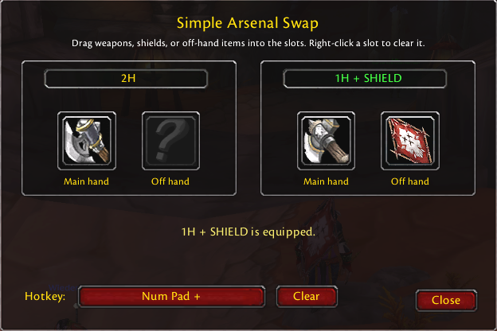

# Simple Arsenal Swap

Simple Arsenal Swap is a small World of Warcraft addon that alternates
between two configured weapon, shield, or off-hand combinations with one hotkey.



## Supported clients

- World of Warcraft Classic Era
- World of Warcraft Classic Hardcore
- Burning Crusade Classic Anniversary
- World of Warcraft: Forever beta — 1.60.1 (69913), live-tested by the maintainer

Version `0.2.0` supports interface `16001` / `Camelot` for Forever,
Era/Hardcore (`11509`), and TBC (`20506`). It uses the client's `C_Item` API when available and falls back to legacy
globals. See `COMPATIBILITY.md` for source evidence, the audit, and live-client checks.

## Usage

1. Type `/sas`.
2. Drag a main-hand weapon into both Arsenal A and Arsenal B.
3. Optionally drag a shield, off-hand weapon, or held item into either off-hand slot.
4. Click the Hotkey button and press a keyboard key, middle or extra mouse button,
   mouse wheel, or modifier combination to bind. Primary left and right mouse
   buttons are intentionally excluded.
5. Press the hotkey to alternate between the two arsenals.

Right-click a configured item slot to clear it. A two-handed weapon automatically
clears and disables the matching off-hand slot. If the selected hotkey already
belongs to another action, the addon asks for confirmation before replacing it.
Click the Arsenal A or Arsenal B heading to give that setup an optional custom
name, then press Enter or click elsewhere; leaving it blank restores the default name.
Starting combat cancels hotkey capture and pending replacement confirmation so
the capture overlay cannot keep intercepting gameplay input.
After the equipped items match the target arsenal, a large 32px green success
message is shown near the combat-text area, using the custom arsenal name when
one is configured. Blizzard combat text and the UI error-message area remain
fallbacks when the dedicated message frame is unavailable.

## Intended combinations

- one-handed weapon and shield to a two-handed weapon;
- one two-handed weapon to another two-handed weapon;
- dual-wield pair to another dual-wield pair;
- one-handed weapon and off-hand item to another combination;
- a main-hand-only switch that leaves the current off hand unchanged.

## Important limitations

- Every swap requires a physical hotkey press.
- Combat swaps are subject to Blizzard's weapon-swap cooldown and protected-action rules.
- Casting, loss of control, item locks, or insufficient bag space may prevent a swap.
- Configured items must be equipped or in the character's bags, not in the bank.
- Identical copies of the same item ID with different enchants may be ambiguous during combat.
- Identical or overlapping arsenals may not produce a visible switch. An empty
  off-hand slot means "leave unchanged", not "unequip": the same main hand with
  a shield versus an empty configured off hand cannot alternate shield on/off.
- Combat behavior remains client-specific. The maintainer confirmed live testing
  of the Forever update; offline tests alone do not prove every weapon combination.

The addon does not automatically react to combat, stances, abilities, health,
buffs, or equipment events. Those events are used only to refresh the display
and prepare the secure hotkey while outside combat.

## Commands

- `/sas` — open settings
- `/sas status` — report configuration and equipped arsenal state
- `/sas help` — show command help

## Development

Run the local validation suite with:

```bash
bash tests/run.sh
```

No external Lua libraries are required.

## Windows deployment

The shared deployment tool is maintained in the separate local
`/home/msminipc/projects/wow-addon-deployer` repository. Run it through
`/home/msminipc/bin/deploy-wow-addons-pc` on MINIPC. It tests and validates the
registered addons before synchronizing their runtime files and does not touch
WoW SavedVariables. Do not restore a private deploy-script copy in this addon
repository; client targets and compatibility flags are maintained centrally.
